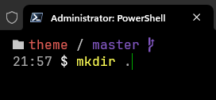

# Custom theme for [Oh My Posh](https://ohmyposh.dev/)
That's a variation of [Json Theme](https://github.com/JanDeDobbeleer/oh-my-posh/blob/main/themes/json.omp.json) that i customized.
It's a very simple theme and combines with [Min Theme](https://marketplace.visualstudio.com/items?itemName=miguelsolorio.min-theme).

---
### Preview
